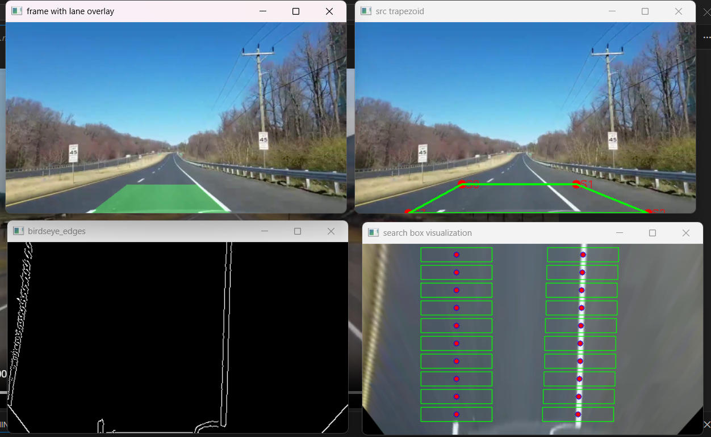
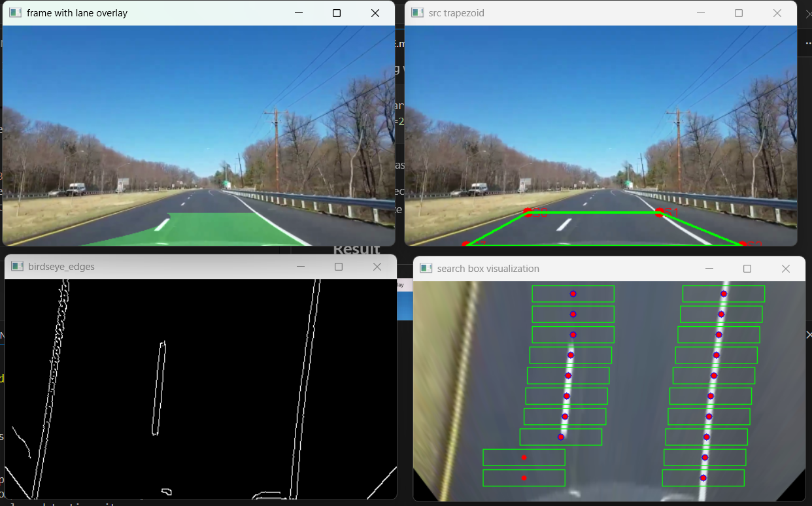

# Lane Detection (OpenCV)

Simple lane detection with perspective transform, edge detection, sliding windows, and polygon overlay.

## How it works

Pipeline per frame:

1. Opencv read the video or webcam inside ([main.py](main.py)).
2. Computing maks in ([edge.py](edge.py)).
3. Getting inverse_perspective
4. create a rectangle box to detect the mask in ([searchBox.py](searchBox.py)).


Windows shown:
- src trapezoid (debug)
- birdseye_edges
- search box visualization
- frame with lane overlay

Press `q` to quit.

## Requirements

- Python 3.10+
- OpenCV and NumPy

```bash
pip install opencv-python numpy
```

## Running

Webcam (index 0):
```bash
python main.py --source 0
```

Video file:
```bash
python main.py --source test_video/test3.mp4 --width 480
```
- If only width or height is given, the other dimension auto-scales.

## Perspective points (ratios)

- Run the ([test.py](test.py)) to get the point_ratios.npz
- If you want to test on a different video, make sure to change the point on lines 48. (tips: just change points 3 and 4)

Generate/update ratios:
```bash
python test.py
```

## Tuning


- Edge AOI and thresholds: [`edge.detect_edges`](edge.py) and [`edge.detect_edges.canny_edge`](edge.py) 

    Default.

    ```python
    detector = detect_edges(frame, mask_height=150) 
    edges = detector.canny_edge(low_threshold=25, high_threshold=80)
    ```
- Sliding windows start/size: edit the `SearchBox` call in [main.py](main.py), e.g.:
  ```python
  search_box = SearchBox(birdseye, birdseye_edges, lx=85, rx=280, y=230, width=100, height=20)
  ```
  See class [`searchBox.SearchBox`](searchBox.py).
- Perspective ROI placement: regenerate `point_ratios.npz` with [test.py](test.py) or replace the file.

## Result

-------------
